# Product Requirements Document: Stayly

**Version:** 1.0
**Status:** Approved for build
**Document type:** Enterprise PRD — source of truth for human engineers and AI coding agents
**Date:** July 2026

---

## 1. Executive Summary

Stayly is a global short-term rental marketplace connecting travelers with unique, verified accommodations — apartments, villas, cabins, hotels, and more — through transparent pricing, instant booking, and AI-assisted discovery. It targets tourists, digital nomads, backpackers, families, and business travelers who are frustrated by hidden fees and opaque search on incumbent platforms. Stayly differentiates on three pillars: **pricing transparency** (all fees shown upfront), **direct host communication**, and **AI-native discovery** (natural-language search, trip planning, price timing advice, and review summarization). V1 ships the full three-sided product — Guest app, Host app, and Admin panel — for a global (Stripe/USD/English) launch, with Indonesia (Midtrans/IDR) staged for a fast-follow regional expansion.

## 2. Business Background

The short-term rental market is dominated by a small number of large incumbents whose fee structures are frequently criticized for opacity (fees revealed late in checkout) and whose search experience is largely form-based (dates, filters, map) rather than conversational. Stayly is conceived as a challenger that keeps the proven core loop of the category (marketplace + booking + payment + review) while investing specifically in the two areas where incumbents are weakest: fee transparency and AI-assisted discovery. This PRD formalizes the product as specified in the founding concept document into a buildable, unambiguous specification.

## 3. Problem Statement

- **Guests** cannot easily tell the true cost of a stay until late in checkout, and struggle to translate a fuzzy need ("cabin near a lake, has a fireplace, under $80") into a filtered search.
- **Guests** have no visibility into whether a listing's price is likely to drop, so they either overpay by booking early or lose availability by waiting.
- **Guests** must read through hundreds of reviews to understand a property's real strengths and weaknesses.
- **Hosts** need a single dashboard to manage listings, reservations, income, and guest communication without juggling spreadsheets.
- **Platform operators** need moderation tooling (listing approval, host verification, dispute/ticket handling) to keep trust high as supply scales.

## 4. Objectives

Framed as OKRs for the first two quarters post-launch:

- **O1: Prove transparent pricing drives conversion.**
  - KR1: 100% of listings show a full price breakdown before the guest enters payment details.
  - KR2: Search-to-booking conversion rate ≥ 4% within Q2.
- **O2: Establish AI discovery as a differentiator.**
  - KR1: ≥ 30% of searches use AI Smart Search (natural language) by end of Q2.
  - KR2: AI Trip Planner sessions convert to at least one booking ≥ 15% of the time.
- **O3: Build trusted, high-quality supply.**
  - KR1: 100% of new listings pass Admin approval before going live.
  - KR2: ≥ 90% of hosts complete identity verification within 7 days of signup.
- **O4: Operational sustainability.**
  - KR1: Payment success rate ≥ 98%.
  - KR2: Support ticket median resolution time ≤ 24 hours.

## 5. Success Metrics

| Metric | Target | Source |
|---|---|---|
| Gross Booking Value (GBV) | Track monthly growth | Payments/Bookings |
| Search-to-booking conversion | ≥ 4% | Analytics events |
| AI feature adoption (any of 5) | ≥ 40% of MAU | AI interaction logs |
| Host activation (listing live within 48h of signup) | ≥ 60% | Properties |
| Cancellation rate | ≤ 8% of bookings | Bookings |
| Average review rating | ≥ 4.3 / 5 | Reviews |
| Payment success rate | ≥ 98% | Payments |
| Support ticket resolution time | ≤ 24h median | Support Tickets |
| App crash-free sessions | ≥ 99.5% | Mobile telemetry |

## 6. Stakeholders

| Role | Responsibility |
|---|---|
| Product Owner | Final sign-off on scope, priorities, and this PRD |
| Engineering Lead | Technical feasibility, architecture sign-off |
| Design Lead | Design system and UX consistency (see Section 18 for style reference) |
| Trust & Safety Lead | Host verification, listing approval policy, dispute handling |
| Finance/Payments Owner | Commission structure, payout policy, Stripe/Midtrans integration sign-off |
| Marketing Lead | Go-to-market for global launch |

## 7. Scope

**In scope for v1:**
- Guest mobile app (Flutter, iOS + Android): auth, search, property detail, booking, payment, trips, wishlist, chat, reviews, notifications, profile.
- Host mobile/web experience: dashboard, property management, reservations, income, calendar, analytics, messaging, payout.
- Admin web panel: user/booking management, revenue, cancellations, support tickets, property approval, host verification, coupons/promotions, CMS, analytics.
- Five AI features: Trip Planner, Smart Search, Price Prediction, Review Summary, Chatbot.
- Global payment via Stripe (USD primary).
- Core monetization: guest service fee, host commission, coupon engine.

**Out of scope for v1** (see Section 43, Future Roadmap):
- Midtrans/IDR and full Indonesia localization.
- Premium Host subscription tier, in-app advertising, travel insurance upsell, airport pickup, and "Experience" bookings (culture/activity add-ons).
- 360° property tours (data model reserved, capture/rendering pipeline deferred).
- Multi-currency display beyond USD.
- Offline mode.

## 8. Out of Scope (explicit exclusions)

- No native desktop application.
- No B2B/API-only channel for third-party travel agencies in v1.
- No dynamic multi-tier admin roles (single Admin role only in v1; Super Admin/Support Agent split is a Phase 2 consideration).
- No white-label or multi-tenant capability.

## 9. User Personas

**1. Maya — Digital Nomad Guest (28)**
Books 1–3 month stays while working remotely. Cares about verified listings and quick host chat to confirm workspace details before booking. High technical proficiency; books entirely via mobile.

**2. The Tanaka Family — Family Traveler (Guests, 35–45)**
Books 4–7 night family vacations. Cares about transparent total cost up front (kids, budget-conscious) and clear house rules. Medium technical proficiency; prefers web for planning, app for on-trip access.

**3. Dimas — Host, Villa Owner (41)**
Manages 3 properties personally. Needs a single dashboard for calendar, reservations, and payout tracking without a spreadsheet. Medium technical proficiency; primarily uses host web dashboard.

**4. Sarah — Backpacker Guest (23)**
Books last-minute, budget-constrained stays (hostels, tiny houses, camping). Highly price-sensitive; uses AI Smart Search and Price Prediction heavily to time bookings. High technical proficiency, mobile-only.

**5. Admin Ops Team — Internal Trust & Safety Staff**
Reviews new listings, verifies host identity, resolves support tickets and disputes. Uses the Admin web panel exclusively during business hours.

## 10. Jobs To Be Done

- When I have a specific, hard-to-filter need, I want to describe it in plain language, so I can skip manual filter tweaking. *(Maya, Sarah → AI Smart Search)*
- When I'm planning a trip on a budget, I want a full itinerary suggestion (stay + attractions + food + transport), so I don't have to research each piece separately. *(Tanaka family → AI Trip Planner)*
- When I'm flexible on dates, I want to know if waiting will save money, so I don't overpay. *(Sarah → AI Price Prediction)*
- When I'm evaluating a listing with hundreds of reviews, I want a fast pros/cons summary, so I can decide without reading everything. *(All guests → AI Review Summary)*
- When I have a policy or refund question at 2am, I want an instant answer, so I don't wait for human support. *(All guests → AI Chatbot)*
- When I manage multiple properties, I want one dashboard for calendar, income, and messages, so I don't context-switch across tools. *(Dimas → Host Dashboard)*
- When new supply joins the platform, I want to vet it before it's visible to guests, so trust stays high. *(Admin Ops → Property Approval)*

## 11. User Journey

1. **Discovery**: Guest opens the app, sees Home with search bar, categories, and trending/nearby recommendations.
2. **Search**: Guest either uses structured filters or types a natural-language query into AI Smart Search.
3. **Evaluation**: Guest opens a Property Detail page, reviews photos, AI Review Summary, price breakdown, and availability calendar; optionally chats with the host.
4. **Decision support**: AI Price Prediction nudges "Book now" or "Wait" if the guest lingers without booking.
5. **Booking**: Guest selects dates/guests, applies a coupon if available, reviews the full price breakdown, and pays via Stripe.
6. **Confirmation**: Guest receives a success animation, a confirmation notification, and the trip appears under "Upcoming" in My Trips.
7. **Stay**: Guest may message the host, view directions, and access booking details from My Trips.
8. **Post-stay**: Guest and host both submit reviews (double-blind); the guest may reuse the wishlist to plan a future trip.
9. **Host side (parallel)**: Host receives a reservation notification, manages the calendar, and later views the payout in the Host Dashboard.

## 12. Information Architecture

Three top-level applications share the same backend and data model:

- **Guest App**: Home → Search → Property Detail → Booking → My Trips / Wishlist / Chat / Reviews / Notifications / Profile.
- **Host App**: Dashboard → Properties → Reservations → Calendar → Income/Payout → Analytics → Messages.
- **Admin Panel**: Dashboard → Users → Bookings → Property Approval → Host Verification → Coupons/Promotions → CMS → Support Tickets → Analytics.

AI features are surfaced contextually inside the Guest App (Smart Search inside Search, Trip Planner as a Home entry point, Price Prediction inside Property Detail, Review Summary inside Property Detail, Chatbot as a persistent help entry point) rather than as a separate top-level section.

## 13. Feature Breakdown

### Feature: Authentication & Account Management

- **Purpose**: Let guests and hosts securely create an account and access the platform with minimal friction.
- **Business Logic**: A single `users` record can hold either the `guest` or `host` role; a user becomes a host by completing host onboarding (adds a `host_profiles` row), not by registering separately. Admin accounts are provisioned manually, never via public signup.
- **Acceptance Criteria**:
  - User can register with email/password, Google, or Apple.
  - User can log in with Face ID/Touch ID after at least one successful password/OAuth login on that device.
  - User can request a password reset via email link (expires in 30 minutes).
  - Duplicate email registration is rejected with a clear error.
- **Edge Cases**: OAuth email already registered via password (offer account linking, not duplicate account); reset link reused after expiry; biometric unavailable on device (fall back to password).
- **Validation Rules**: Email format RFC 5322; password minimum 8 chars, 1 number, 1 letter; phone number in E.164 format if provided.
- **API Dependencies**: `POST /auth/register`, `POST /auth/login`, `POST /auth/oauth/{provider}`, `POST /auth/forgot-password`, `POST /auth/reset-password`, `POST /auth/refresh`.
- **Database Impact**: Reads/writes `users`; writes `audit_logs` on password reset.
- **UI Components**: Login form, Register form, OAuth buttons, Forgot Password modal, biometric prompt.
- **State Management**: Auth token + refresh token in secure storage (Flutter Keychain/Keystore); global auth state via app-level state provider.
- **Error Handling**: Invalid credentials → inline field error, no account enumeration ("email or password incorrect"). OAuth failure → toast + retry option.
- **Loading State**: Button spinner on submit; form disabled during request.
- **Empty State**: N/A (form-based feature).
- **Permissions**: Public (unauthenticated) endpoint; rate-limited to prevent brute force.
- **Analytics Events**: `signup_started`, `signup_completed`, `login_success`, `login_failed`, `password_reset_requested`.
- **Test Cases**: (1) Register with valid email/password succeeds and returns a session. (2) Register with an already-used email returns a 409 conflict. (3) Login with correct email but wrong password is rejected without revealing which field was wrong.

### Feature: Property Search & Discovery

- **Purpose**: Let guests find relevant listings via structured filters, map/list view, and categories.
- **Business Logic**: Search results rank by a weighted score of relevance (text/category match), rating, and recency, with sponsored/featured listings (Phase 2) excluded from v1 ranking.
- **Acceptance Criteria**:
  - Guest can filter by date, guest count, price range, rating, property type, and amenities.
  - Guest can toggle between Map View and List View without losing applied filters.
  - Guest can sort by Cheapest, Highest Rating, Nearest, Newest.
- **Edge Cases**: Zero results for a filter combination (show "no results" state with a "clear filters" CTA); price slider min > max blocked client-side; location permission denied (fall back to city-level search).
- **Validation Rules**: Check-in date must be ≥ today; check-out date must be after check-in; guest count ≤ property's max_guests at query time (soft filter, not hard reject).
- **API Dependencies**: `GET /properties/search` (query params: dates, guests, price_min, price_max, rating_min, type, amenities[], sort, lat/lng/radius).
- **Database Impact**: Reads `properties`, `property_images`, `property_availability`; read-heavy, indexed on city/type/price.
- **UI Components**: Search bar, filter sheet, category chips, map component (Google Maps SDK), listing card, sort dropdown.
- **State Management**: Filter state held in a search-scoped store; persisted across Map/List toggle; cleared on new search intent.
- **Error Handling**: Maps API failure → fall back to list view with a non-blocking banner.
- **Loading State**: Skeleton listing cards while results load.
- **Empty State**: "No stays match your filters" with a clear-filters action.
- **Permissions**: Public read; no auth required to search.
- **Analytics Events**: `search_performed`, `filter_applied`, `sort_changed`, `map_view_toggled`.
- **Test Cases**: (1) Search with valid date range and city returns matching active listings only. (2) Search excludes properties with status ≠ `active`. (3) Applying an amenity filter with no matches returns the empty state, not an error.

### Feature: Property Detail & Price Breakdown

- **Purpose**: Give the guest everything needed to decide and book, with the full cost shown before payment.
- **Business Logic**: Total price = (nightly rate × nights) + cleaning fee + service fee (guest-side %) − coupon discount, always computed server-side and re-verified at booking time (never trusted from client state).
- **Acceptance Criteria**:
  - Page displays photos, host profile, description, amenities, house rules, location, nearby attractions, reviews, availability calendar.
  - Price breakdown itemizes nightly rate × nights, cleaning fee, service fee, and total — before the guest reaches payment.
  - AI Review Summary and AI Price Prediction are shown inline (see their own feature entries).
- **Edge Cases**: Listing goes inactive/unavailable while guest is viewing (show a banner, disable Reserve); host has zero reviews yet (show "New host" badge instead of rating).
- **Validation Rules**: Requested date range must be within `property_availability` as available and not already booked.
- **API Dependencies**: `GET /properties/{id}`, `GET /properties/{id}/availability`, `GET /properties/{id}/reviews`, `GET /properties/{id}/price-breakdown`.
- **Database Impact**: Reads `properties`, `property_images`, `property_availability`, `reviews`.
- **UI Components**: Photo gallery, host card, amenities grid, availability calendar, price breakdown card, sticky "Reserve" button.
- **State Management**: Property detail is fetched fresh per visit (not cached long-term) to avoid stale pricing/availability.
- **Error Handling**: 404 for deleted/suspended listing → redirect to search with a message.
- **Loading State**: Skeleton gallery + shimmer text blocks.
- **Empty State**: "No reviews yet" state when `review_count = 0`.
- **Permissions**: Public read; Reserve action requires authentication.
- **Analytics Events**: `property_viewed`, `price_breakdown_viewed`, `reserve_clicked`.
- **Test Cases**: (1) Price breakdown total matches server-side calculation exactly. (2) Booking attempt on a date range that became unavailable is rejected with a clear message. (3) Unauthenticated user tapping Reserve is routed to login, then returned to the same property.

### Feature: Booking & Checkout

- **Purpose**: Convert a selected property + dates into a confirmed reservation.
- **Business Logic**: A booking is `pending` until payment succeeds; inventory (availability) is soft-locked for 10 minutes during checkout to prevent double-booking, released if payment isn't completed in that window.
- **Acceptance Criteria**:
  - Guest can choose dates and guest count, apply one coupon, and see an updated total before confirming.
  - On successful payment, booking status becomes `confirmed` and a success animation plays.
  - Booking confirmation triggers a notification to both guest and host.
- **Edge Cases**: Two guests attempt to book overlapping dates simultaneously (first successful payment wins; second is rejected with "dates no longer available" and a refund is not needed since payment wasn't captured yet); invalid/expired coupon code (reject with reason).
- **Validation Rules**: Coupon must be `is_active`, within `valid_from`/`valid_to`, and under `max_uses`; guest_count ≤ property.max_guests.
- **API Dependencies**: `POST /bookings` (creates pending booking + soft lock), `POST /bookings/{id}/confirm` (post-payment), `POST /coupons/validate`.
- **Database Impact**: Writes `bookings`; reads/writes `property_availability` (soft lock); reads `coupons`.
- **UI Components**: Date picker, guest counter, coupon input, booking summary, Stripe payment sheet, success animation.
- **State Management**: Checkout flow state is local to the booking session; cleared on completion or abandonment.
- **Error Handling**: Payment decline → return to payment step with the specific decline reason from Stripe where safe to surface.
- **Loading State**: "Confirming your booking..." spinner between payment success and booking confirmation.
- **Empty State**: N/A.
- **Permissions**: Authenticated guests only.
- **Analytics Events**: `booking_started`, `coupon_applied`, `booking_confirmed`, `booking_abandoned`.
- **Test Cases**: (1) Booking with a valid coupon reduces total by the correct amount. (2) Two simultaneous booking attempts for the same dates result in exactly one `confirmed` booking. (3) Abandoned checkout (soft lock expires) releases the availability.

### Feature: Payment Processing

- **Purpose**: Securely capture guest payment and route funds toward host payout and platform commission.
- **Business Logic**: Stripe PaymentIntents are used for capture; Stayly never stores raw card data (PCI scope minimized to Stripe Elements/SDK). On successful capture, a `transactions` ledger entry is created for the guest payment, and a scheduled payout transaction is queued for the host (see Host Payout feature).
- **Acceptance Criteria**: Payment is captured only after 3-D Secure/SCA challenge (if required) succeeds; a booking is only marked `confirmed` after Stripe confirms the PaymentIntent as `succeeded`.
- **Edge Cases**: Card requires 3DS and guest abandons the challenge (booking stays `pending`, then expires); webhook delivery delay (booking held in `pending` until webhook confirms, with a client-side polling fallback).
- **Validation Rules**: Amount charged must exactly match the server-computed price breakdown at confirm time.
- **API Dependencies**: `POST /payments/create-intent`, Stripe webhook `POST /webhooks/stripe`.
- **Database Impact**: Writes `payments`, `transactions`.
- **UI Components**: Stripe payment sheet, 3DS challenge webview, payment status indicator.
- **State Management**: Payment status polled/observed until terminal state (`succeeded`/`failed`).
- **Error Handling**: Failed payment surfaces Stripe's decline_code mapped to a guest-friendly message; retries allowed.
- **Loading State**: "Processing payment..." with a timeout fallback message after 15s.
- **Empty State**: N/A.
- **Permissions**: Authenticated guests only; webhook endpoint verified via Stripe signature, not user-authenticated.
- **Analytics Events**: `payment_initiated`, `payment_succeeded`, `payment_failed`.
- **Test Cases**: (1) Successful PaymentIntent transitions booking to `confirmed`. (2) Webhook signature mismatch is rejected and logged. (3) A charged amount that doesn't match the server-computed total is blocked before capture.

### Feature: My Trips

- **Purpose**: Give guests a single place to track upcoming, completed, and cancelled bookings.
- **Business Logic**: A booking moves from Upcoming → Completed automatically at checkout_date + 1 day (server-side scheduled job); Cancelled bookings show the applied cancellation policy outcome (refund amount, if any).
- **Acceptance Criteria**: Each tab (Upcoming/Completed/Cancelled) lists bookings with property, dates, and status; tapping a trip opens full booking details.
- **Edge Cases**: Booking cancelled by host (rare, e.g. property removed) — show a distinct "Cancelled by host" state with an automatic refund.
- **Validation Rules**: N/A (read-focused feature).
- **API Dependencies**: `GET /bookings/me?status=upcoming|completed|cancelled`.
- **Database Impact**: Reads `bookings`, `properties`.
- **UI Components**: Tab bar, trip card list.
- **State Management**: Paginated list, cached per tab.
- **Error Handling**: Network failure → retry button.
- **Loading State**: Skeleton trip cards.
- **Empty State**: "No trips yet" with a CTA to search.
- **Permissions**: Authenticated guest, scoped to own bookings only.
- **Analytics Events**: `trips_tab_viewed`.
- **Test Cases**: (1) A booking automatically appears under Completed the day after checkout. (2) A guest cannot see another guest's bookings via this endpoint.

### Feature: Wishlist

- **Purpose**: Let guests save properties into named folders (e.g. "Bali", "Honeymoon") for later planning.
- **Business Logic**: A wishlist item references a property snapshot at save-time for display, but always links live to current price/availability when opened.
- **Acceptance Criteria**: Guest can create a folder, save a property into one or more folders, and remove a saved property.
- **Edge Cases**: Saved property later deleted/suspended by host (show "no longer available" in the folder, not a broken link).
- **Validation Rules**: Folder name required, max 50 characters, unique per user.
- **API Dependencies**: `POST /wishlists`, `POST /wishlists/{id}/items`, `DELETE /wishlists/{id}/items/{propertyId}`.
- **Database Impact**: Writes `wishlists`, `wishlist_items`.
- **UI Components**: Folder list, save-to-folder modal (heart icon on listing cards).
- **State Management**: Local optimistic update on save/unsave, reconciled with server response.
- **Error Handling**: Save failure → revert optimistic UI state, show toast.
- **Loading State**: Heart icon shows a brief animated state on tap.
- **Empty State**: "Save your favorite stays" prompt.
- **Permissions**: Authenticated guest, own wishlists only.
- **Analytics Events**: `wishlist_item_saved`, `wishlist_folder_created`.
- **Test Cases**: (1) Saving the same property to two folders creates two `wishlist_items` rows. (2) Removing an item doesn't delete the folder if other items remain.

### Feature: In-App Messaging (Chat)

- **Purpose**: Let guests and hosts communicate directly about a stay.
- **Business Logic**: One conversation thread per guest–host–property combination; messages support text, image, location, a booking attachment card, and voice notes.
- **Acceptance Criteria**: Messages deliver in real time when both parties are online; delivery/read receipts are shown; a booking attachment renders as a rich card, not plain text.
- **Edge Cases**: Recipient offline (message queued, delivered via push notification); large image upload (client-side compression before send); voice note exceeding max duration (60s cap, trimmed client-side).
- **Validation Rules**: Text message max 2,000 characters; image max 10MB; voice note max 60 seconds.
- **API Dependencies**: `POST /conversations`, `GET /conversations/{id}/messages`, WebSocket channel via Socket.IO for real-time delivery.
- **Database Impact**: Writes `conversations`, `messages`.
- **UI Components**: Chat thread list, message bubble, attachment picker, voice recorder.
- **State Management**: Message list held in a per-conversation store, appended via WebSocket events; optimistic send with a pending indicator until server ack.
- **Error Handling**: Send failure → message marked "failed to send" with a retry tap.
- **Loading State**: Skeleton bubbles on thread open.
- **Empty State**: "Start the conversation" prompt.
- **Permissions**: Only the two participants (guest, host) of a conversation can read/write it.
- **Analytics Events**: `message_sent`, `conversation_started`.
- **Test Cases**: (1) A message sent while the recipient is offline is delivered as a push notification and appears on next app open. (2) A user cannot fetch messages for a conversation they aren't part of (403).

### Feature: Reviews & Ratings

- **Purpose**: Build trust through mutual guest/host feedback after a completed stay.
- **Business Logic**: Reviews are double-blind — neither party sees the other's review until both have submitted, or 14 days have passed since checkout, whichever comes first (`visible_at` computed accordingly). Only bookings with status `completed` are eligible.
- **Acceptance Criteria**: Guest and host can each submit a star rating (1–5), a comment, and optional photos; host can reply to a published guest review.
- **Edge Cases**: One party never submits (the other's review still publishes at the 14-day mark); guest attempts to review a booking that isn't yet `completed` (blocked).
- **Validation Rules**: Rating required (1–5 integer); comment max 1,000 characters; max 5 photos per review.
- **API Dependencies**: `POST /bookings/{id}/reviews`, `POST /reviews/{id}/reply`, `GET /properties/{id}/reviews`.
- **Database Impact**: Writes `reviews`; updates `properties.avg_rating` and `review_count` on publish (aggregation job or trigger).
- **UI Components**: Star rating input, comment box, photo uploader, review card, host reply thread.
- **State Management**: Draft review held locally until submit.
- **Error Handling**: Submit failure → keep the draft locally, allow retry.
- **Loading State**: Submit button spinner.
- **Empty State**: "No reviews yet" on a property with zero published reviews.
- **Permissions**: Only the guest/host of the specific completed booking can submit; only the reviewed host can reply.
- **Analytics Events**: `review_submitted`, `host_reply_submitted`.
- **Test Cases**: (1) A review submitted by only one party doesn't display until the other submits or 14 days elapse. (2) `avg_rating` recalculates correctly after a new review publishes. (3) A guest cannot review a `cancelled` booking.

### Feature: Notifications

- **Purpose**: Keep guests and hosts informed of booking, discount, reminder, and promotional events.
- **Business Logic**: Notifications are generated server-side from domain events (booking confirmed, message received, price drop on wishlisted property, promotion published) and delivered via push (FCM) plus an in-app inbox.
- **Acceptance Criteria**: Notification inbox lists items newest-first with read/unread state; tapping a notification deep-links to the relevant screen (booking, chat, property).
- **Edge Cases**: Push permission denied (in-app inbox still populates); duplicate event suppression (e.g. don't send two "booking confirmed" pushes for one booking).
- **Validation Rules**: N/A (system-generated).
- **API Dependencies**: `GET /notifications`, `POST /notifications/{id}/read`, FCM token registration `POST /users/me/fcm-token`.
- **Database Impact**: Writes/reads `notifications`.
- **UI Components**: Notification list, unread badge, deep-link routing.
- **State Management**: Unread count held in global app state, decremented on read.
- **Error Handling**: FCM delivery failure logged, in-app inbox is the source of truth.
- **Loading State**: Skeleton list.
- **Empty State**: "You're all caught up."
- **Permissions**: Authenticated user, own notifications only.
- **Analytics Events**: `notification_received`, `notification_opened`.
- **Test Cases**: (1) Booking confirmation generates exactly one notification per participant. (2) Reading a notification updates its `is_read` flag and decrements the badge count.

### Feature: Host Dashboard & Property Management

- **Purpose**: Give hosts a single control center for listings, reservations, and performance.
- **Business Logic**: A new or edited listing enters `pending_review` status and is invisible to guest search until an Admin approves it (see Admin — Property Approval).
- **Acceptance Criteria**: Host can create/edit/deactivate a listing (title, description, type, photos, amenities, house rules, pricing, availability calendar); dashboard summarizes upcoming reservations, occupancy rate, and recent reviews.
- **Edge Cases**: Host edits a live listing's price mid-booking-flow for a guest (existing pending booking keeps its originally quoted price); host attempts to delete a listing with active future bookings (blocked; must wait until bookings complete or be cancelled through support).
- **Validation Rules**: At least 1 photo required to submit for review; price_per_night > 0; max_guests ≥ 1.
- **API Dependencies**: `POST /host/properties`, `PUT /host/properties/{id}`, `GET /host/dashboard-summary`, `PUT /host/properties/{id}/availability`.
- **Database Impact**: Writes `properties`, `property_images`, `property_availability`.
- **UI Components**: Listing form (multi-step), calendar editor, dashboard summary cards.
- **State Management**: Draft listing held locally across multi-step form until submit.
- **Error Handling**: Validation errors shown per-field on the relevant form step.
- **Loading State**: Skeleton dashboard cards on load.
- **Empty State**: "Create your first listing" prompt for hosts with zero properties.
- **Permissions**: Host role only, scoped to own properties.
- **Analytics Events**: `listing_created`, `listing_submitted_for_review`, `listing_edited`.
- **Test Cases**: (1) A newly created listing is not visible in guest search until `status = active`. (2) Editing price does not retroactively change an already-confirmed booking's total. (3) A listing with a future confirmed booking cannot be deleted.

### Feature: Host Reservations, Analytics & Payout

- **Purpose**: Let hosts track bookings, income, and receive payouts.
- **Business Logic**: Payout = booking total − guest service fee (not host-borne) − host commission, released 24 hours after guest check-in, batched weekly per host.
- **Acceptance Criteria**: Host sees a reservations list (per property, per date range), an income summary, an occupancy rate chart, and a payout history with status.
- **Edge Cases**: Booking is cancelled/refunded after payout has already been scheduled but before it's released (payout is withheld and adjusted); host bank/payout details missing (payout queued but flagged "action needed").
- **Validation Rules**: Payout requires a verified payout method on file.
- **API Dependencies**: `GET /host/reservations`, `GET /host/income-summary`, `GET /host/payouts`.
- **Database Impact**: Reads `bookings`, `transactions`; writes `transactions` (payout entries).
- **UI Components**: Reservation table, income chart, occupancy chart, payout history list.
- **State Management**: Date-range-scoped queries, re-fetched on range change.
- **Error Handling**: Payout provider error → retry with exponential backoff, surfaced in payout status.
- **Loading State**: Chart skeletons.
- **Empty State**: "No reservations yet" for new hosts.
- **Permissions**: Host role only, own data only.
- **Analytics Events**: `payout_released`, `payout_failed`.
- **Test Cases**: (1) A cancelled booking after payout scheduling correctly withholds/reverses the payout. (2) Income summary total matches the sum of underlying confirmed bookings for the period.

### Feature: Admin — User, Booking & Property Moderation

- **Purpose**: Give the Trust & Safety/Ops team control over marketplace quality and disputes.
- **Business Logic**: A listing submitted by a host stays `pending_review` until an Admin approves (`active`) or rejects (with a reason returned to the host) it. Host identity verification follows the same approve/reject pattern.
- **Acceptance Criteria**: Admin dashboard shows total users, total bookings, revenue, and cancellation rate; Admin can approve/reject pending listings and host verifications; Admin can view/manage support tickets.
- **Edge Cases**: Admin rejects a listing that already has pending guest interest (chat) — host is notified with the rejection reason so they can resubmit.
- **Validation Rules**: Rejection requires a reason (free text, min 10 characters) so the host can act on it.
- **API Dependencies**: `GET /admin/dashboard`, `PUT /admin/properties/{id}/approve`, `PUT /admin/properties/{id}/reject`, `PUT /admin/hosts/{id}/verify`, `GET /admin/support-tickets`, `PUT /admin/support-tickets/{id}`.
- **Database Impact**: Writes `properties.status`, `host_profiles.verification_status`, `support_tickets`; writes `audit_logs` for every admin action.
- **UI Components**: Admin dashboard cards/charts, approval queue table, ticket management view.
- **State Management**: Server-driven, minimal client state (admin panel is CRUD-heavy).
- **Error Handling**: Concurrent approval attempts (two admins) — last write wins, but both actions are audit-logged.
- **Loading State**: Table skeletons.
- **Empty State**: "No pending listings" / "No open tickets".
- **Permissions**: Admin role only.
- **Analytics Events**: `listing_approved`, `listing_rejected`, `host_verified`, `ticket_resolved`.
- **Test Cases**: (1) Rejected listing does not appear in guest search and host receives the rejection reason. (2) Every approval/rejection action produces an `audit_logs` row with the admin's identity.

### Feature: Admin — Coupons, Promotions & CMS

- **Purpose**: Let Admin run discount campaigns and manage static/marketing content.
- **Business Logic**: A coupon is valid only within its date window and under its usage cap; CMS content (e.g. category descriptions, help articles) is versioned but only the latest published version is served.
- **Acceptance Criteria**: Admin can create/edit/deactivate coupons (percentage or fixed discount, usage cap, validity window); Admin can publish CMS content blocks.
- **Edge Cases**: Coupon usage cap reached mid-checkout for a guest (booking checkout re-validates and rejects with a clear message rather than trusting a client-cached "valid" state).
- **Validation Rules**: Percentage discount 1–100; fixed discount > 0; `valid_from` < `valid_to`.
- **API Dependencies**: `POST /admin/coupons`, `PUT /admin/coupons/{id}`, `POST /admin/cms/content`.
- **Database Impact**: Writes `coupons`, CMS content table.
- **UI Components**: Coupon form, CMS content editor.
- **State Management**: Server-driven CRUD.
- **Error Handling**: Overlapping coupon codes rejected with a uniqueness error.
- **Loading State**: Form submit spinner.
- **Empty State**: "No active coupons".
- **Permissions**: Admin role only.
- **Analytics Events**: `coupon_created`, `coupon_redeemed`.
- **Test Cases**: (1) A coupon at its usage cap is rejected on the next redemption attempt. (2) An expired coupon cannot be applied even if the guest had it cached client-side.

### Feature: AI Trip Planner

- **Purpose**: Turn a budget/duration/destination prompt into a suggested itinerary (stay + attractions + food + transport).
- **Business Logic**: The prompt is sent to an LLM with a function-calling/tool schema that queries live Stayly inventory (properties matching destination/budget) rather than letting the model invent listings; attractions/restaurants/transport suggestions may come from the LLM's general knowledge but are clearly labeled as suggestions, not bookable inventory (except properties, which link to real listings).
- **Acceptance Criteria**: Guest enters a free-text prompt (destination, duration, budget); response includes at least one real, bookable property recommendation plus supporting itinerary suggestions.
- **Edge Cases**: No properties match the budget/destination (respond with the closest available options and an explanation, never a fabricated listing); prompt lacks a destination (ask a clarifying follow-up rather than guessing).
- **Validation Rules**: Prompt max 500 characters; budget must parse to a positive number if provided.
- **API Dependencies**: `POST /ai/trip-planner` → internally calls `GET /properties/search` as a tool before returning recommendations.
- **Database Impact**: Reads `properties`; writes `ai_interaction_logs` for analytics.
- **UI Components**: Chat-style input, itinerary result cards (property, attraction, restaurant, transport sections).
- **State Management**: Conversation-scoped, not persisted long-term beyond the session (v1).
- **Error Handling**: LLM/tool timeout → fallback message directing the guest to manual search.
- **Loading State**: "Planning your trip..." animated state.
- **Empty State**: N/A (always returns a response or a clarifying question).
- **Permissions**: Authenticated guest (to allow personalization); usable without booking history.
- **Analytics Events**: `trip_planner_queried`, `trip_planner_result_clicked`.
- **Test Cases**: (1) A prompt with a valid destination and budget returns at least one real property matching the search API. (2) A prompt with no destination triggers a clarifying question, not a hallucinated itinerary.

### Feature: AI Smart Search

- **Purpose**: Let guests search using natural language instead of manual filters.
- **Business Logic**: The natural-language query is parsed into structured filter parameters (property type, amenities, price ceiling, location proximity) via an LLM extraction step, then executed against the same `GET /properties/search` endpoint used by structured search — the AI layer only translates intent, it never bypasses real inventory or ranking logic.
- **Acceptance Criteria**: A query like "cabin near a lake with a fireplace under $80" returns results filtered by type=cabin, amenity≈fireplace, price_max=80, and location proximity to a lake (via Maps geocoding of "lake" landmarks near the guest's area/destination context).
- **Edge Cases**: Query has no extractable structured filters (fall back to full-text search against title/description); extracted filters yield zero results (show empty state with the interpreted filters visible, so the guest can adjust).
- **Validation Rules**: Query max 200 characters.
- **API Dependencies**: `POST /ai/smart-search` → `GET /properties/search`.
- **Database Impact**: Reads `properties`; writes `ai_interaction_logs`.
- **UI Components**: Natural-language search bar (same bar as structured search, toggled by input style), interpreted-filter chips shown above results.
- **State Management**: Extracted filters populate the same search filter state used elsewhere, so a guest can refine manually afterward.
- **Error Handling**: Extraction failure → fall back to plain full-text search silently (no error shown to guest).
- **Loading State**: Same skeleton as structured search.
- **Empty State**: "No stays match '[interpreted filters]'" with a clear-filters action.
- **Permissions**: Public (same as structured search).
- **Analytics Events**: `smart_search_queried`, `smart_search_filters_extracted`.
- **Test Cases**: (1) A query with an explicit price ceiling never returns results above that price. (2) A query with no interpretable filters still returns full-text-matched results rather than an error.

### Feature: AI Price Prediction

- **Purpose**: Advise a guest whether to book now or wait, based on likely price movement.
- **Business Logic**: A prediction service (statistical/heuristic model over historical pricing and demand signals per property/area — not a generic LLM guess) outputs a recommendation ("Book now" or "Wait N days") with a confidence indicator; recomputed periodically (e.g. daily) per property, not per page view, for cost/perf reasons.
- **Acceptance Criteria**: Property Detail shows a "Book now" or "Wait" badge with a short reason (e.g. "Prices for this area tend to drop 3 days before check-in").
- **Edge Cases**: Insufficient historical data for a new listing/area (hide the badge rather than showing a low-confidence guess).
- **Validation Rules**: N/A (system-generated, read-only to guests).
- **API Dependencies**: `GET /properties/{id}/price-prediction`.
- **Database Impact**: Reads a precomputed prediction table/cache; no guest-facing write.
- **UI Components**: Prediction badge on Property Detail.
- **State Management**: Cached client-side for the session (prediction doesn't change within one viewing session).
- **Error Handling**: Prediction service unavailable → hide the badge silently, never block the page.
- **Loading State**: Badge appears after a brief shimmer, non-blocking to the rest of the page.
- **Empty State**: Badge simply absent when there's no confident prediction.
- **Permissions**: Public read.
- **Analytics Events**: `price_prediction_shown`, `price_prediction_influenced_booking` (booking occurred within the session after viewing the badge).
- **Test Cases**: (1) A listing with under the minimum historical data threshold shows no badge. (2) The badge's recommendation matches the underlying prediction service's latest output for that property.

### Feature: AI Review Summary

- **Purpose**: Summarize a property's reviews into quick pros/cons.
- **Business Logic**: Summary is regenerated when review count crosses defined thresholds (e.g. every +20 new reviews) rather than on every page load, to control cost; the summary must be traceable to actual review content (no fabricated pros/cons).
- **Acceptance Criteria**: Property Detail shows a "Pros" and "Cons" list (each 2–5 short bullet points) derived from published reviews.
- **Edge Cases**: Fewer than a minimum review count (e.g. 5) — show "Not enough reviews yet for a summary" instead of forcing a low-quality summary.
- **Validation Rules**: N/A (system-generated).
- **API Dependencies**: `GET /properties/{id}/review-summary` (served from a precomputed cache, regenerated via a background job).
- **Database Impact**: Reads `reviews`; writes to a `review_summaries` cache table.
- **UI Components**: Pros/Cons list component on Property Detail.
- **State Management**: Cached, refreshed only via the background regeneration job.
- **Error Handling**: Generation failure → keep serving the last successfully generated summary.
- **Loading State**: Skeleton bullet list.
- **Empty State**: "Not enough reviews yet" for low-review-count properties.
- **Permissions**: Public read.
- **Analytics Events**: `review_summary_viewed`.
- **Test Cases**: (1) A property under the minimum review threshold shows the "not enough reviews" state, not an empty/broken summary. (2) Regeneration only triggers at defined review-count thresholds, not on every new review.

### Feature: AI Chatbot (Support Assistant)

- **Purpose**: Answer common guest questions about refunds, bookings, and policy instantly, escalating to human support when needed.
- **Business Logic**: The chatbot has read access to the guest's own booking/policy data (via tool calls) to answer specifically, not generically; if the query implies a refund/dispute the bot cannot resolve directly, it creates a `support_tickets` entry and hands off to a human Admin.
- **Acceptance Criteria**: Guest can ask about refund eligibility, booking status, and cancellation policy and get an accurate, account-specific answer; guest can request "talk to a human" at any point.
- **Edge Cases**: Ambiguous request that could mean either a policy question or a live dispute (bot asks a clarifying question before creating a ticket); guest asks about another user's booking (blocked — bot only has access to the requesting guest's own data).
- **Validation Rules**: Message max 500 characters per turn.
- **API Dependencies**: `POST /ai/chatbot` → tool calls into `GET /bookings/{id}`, `GET /properties/{id}` (policy fields), `POST /support-tickets` (on escalation).
- **Database Impact**: Reads `bookings`, `properties`; writes `support_tickets` on escalation; writes `ai_interaction_logs`.
- **UI Components**: Chat widget (persistent help entry point), "Talk to a human" button.
- **State Management**: Conversation held for the session; escalated tickets persist independently in `support_tickets`.
- **Error Handling**: Tool call failure (e.g. booking lookup fails) → bot informs the guest it couldn't retrieve the info and offers escalation.
- **Loading State**: Typing indicator.
- **Empty State**: Greeting message with example questions on first open.
- **Permissions**: Authenticated guest; scoped strictly to the requesting user's own bookings.
- **Analytics Events**: `chatbot_query_sent`, `chatbot_escalated_to_human`.
- **Test Cases**: (1) A refund-eligibility question against the guest's own past booking returns an answer consistent with the booking's actual cancellation policy. (2) A request to view another user's booking is refused. (3) An unresolvable dispute correctly creates a `support_tickets` row.

## 14. Functional Requirements

Numbered, testable requirements (a condensed cross-reference to Section 13; each maps 1:1 to a feature's Acceptance Criteria above):

- FR-1 through FR-19 correspond to the 19 features in Section 13, in order. Each feature's Acceptance Criteria bullets are the binding functional requirements for that feature — engineers should treat every bullet under "Acceptance Criteria" as a numbered FR (e.g. FR-4.1, FR-4.2 for Booking & Checkout's first and second criteria).
- FR-20: All monetary calculations (price breakdown, coupon discount, commission, payout) must be computed server-side; client-submitted totals are never trusted.
- FR-21: All state-changing admin actions must write an `audit_logs` entry including actor, action, target, and timestamp.

## 15. Non-Functional Requirements

- **Performance**: API p95 response time ≤ 400ms for read endpoints, ≤ 800ms for write/payment endpoints (excluding third-party payment provider latency). Mobile app cold start ≤ 2.5s.
- **Availability**: 99.9% uptime target for core booking/payment path.
- **Scalability**: Architecture must support horizontal scaling of API instances behind a load balancer; target initial capacity ~50,000 MAU (Year 1, low-confidence estimate — revisit with actual growth data).
- **Security level**: See Section 29.
- **Localization**: English (v1); architecture must not hardcode strings (i18n-ready) so Bahasa Indonesia can be added in Phase 2 without rework.
- **Accessibility**: WCAG 2.1 AA target across Guest and Host apps; Admin panel targets WCAG 2.1 A at minimum (internal tool).
- **Offline mode**: Not required for v1. Guest app should degrade gracefully (clear "no connection" state) rather than crash.

## 16. Business Rules

- **Pricing**: Guest service fee = 3% of (nightly rate × nights), added at checkout. Host commission = 12% of (nightly rate × nights), deducted before payout. *(Both figures are placeholder defaults — Low confidence — finance should confirm before production launch.)*
- **Cancellation policy**: Three tiers set per listing by the host — Flexible (full refund up to 24h before check-in), Moderate (full refund up to 5 days before), Strict (50% refund up to 7 days before, none after).
- **Coupons**: Percentage or fixed discount, capped usage, bounded validity window; re-validated server-side at checkout regardless of client-side display.
- **Payout**: Released 24 hours after guest check-in, batched weekly per host; withheld/reversed if the booking is cancelled/refunded before release.
- **Review visibility**: Double-blind, revealed on both-submitted or 14 days post-checkout, whichever is first.
- **Listing approval**: Every new or materially-edited (price, photos, description) listing re-enters `pending_review` and requires Admin approval before being guest-visible.
- **Notification triggers**: Booking confirmed/cancelled, new message received, review published, coupon/promotion published, price-drop on a wishlisted property.

## 17. Permission Matrix

| Feature / Action | Guest | Host | Admin |
|---|---|---|---|
| Browse/search properties | ✅ | ✅ | ✅ |
| Book a property | ✅ | ❌ (own listings) | ❌ |
| Create/edit own listing | ❌ | ✅ | ❌ (edit; can approve/reject) |
| Approve/reject listing | ❌ | ❌ | ✅ |
| View own bookings | ✅ | ✅ (as reservations) | ✅ (all, for support) |
| Send/receive chat messages | ✅ (own conversations) | ✅ (own conversations) | ❌ |
| Submit review | ✅ (own completed bookings) | ✅ (own completed bookings, of guest) | ❌ |
| Reply to review | ❌ | ✅ (own listing's reviews) | ❌ |
| Manage coupons/promotions | ❌ | ❌ | ✅ |
| View platform revenue/analytics | ❌ | ✅ (own only) | ✅ (all) |
| Verify host identity | ❌ | ❌ | ✅ |
| Manage support tickets | ❌ (can create) | ❌ (can create) | ✅ (resolve/manage) |
| Access AI features (Trip Planner, Smart Search, Price Prediction, Review Summary, Chatbot) | ✅ | ❌ (guest-facing only) | ❌ |

## 18. Wireframe Planning

Reference design system pulled directly from the source concept document (`DESIGN-airbnb.md`):

- **Style**: Minimal, Apple-inspired, rounded cards, soft shadows, full-screen photography, large typography, generous whitespace, smooth animations.
- **Color tokens**:
  - Primary: `#FF5A5F` (CTAs, active states, brand accents)
  - Secondary: `#FFFFFF` (surfaces/backgrounds)
  - Accent: `#0F172A` (primary text, dark UI elements)
  - Success: `#22C55E` (confirmations, positive states)
  - Warning: `#F59E0B` (alerts, pending states)

**Key screen regions:**
- **Home**: Sticky search bar (region: top) → horizontal category chip scroller (region: upper-mid) → Recommended/Trending/Nearby sections as card carousels (region: scrollable body).
- **Property Detail**: Full-bleed photo gallery (top, swipeable) → host card + rating (upper body) → description/amenities/house rules (scrollable body, collapsible sections) → sticky bottom bar with price + "Reserve" CTA.
- **Booking Checkout**: Stepper layout (Dates → Guests → Payment → Summary), price breakdown card persists at the bottom across all steps.
- **Host Dashboard**: Card-grid summary (reservations, income, occupancy) at top, tabbed navigation to Properties/Reservations/Calendar/Analytics below.
- **Admin Panel**: Left sidebar navigation (Dashboard/Users/Bookings/Properties/Coupons/Tickets/CMS/Analytics), main content area as data tables and charts — denser, functional layout (not consumer-styled), still using the same color tokens for consistency.

## 19. Navigation

- **Guest App**: Bottom tab bar — Home, Search, Trips, Wishlist, Profile (with Chat and Notifications reachable from Home/Profile badges).
- **Host App**: Bottom tab bar (mobile) or side nav (web) — Dashboard, Properties, Reservations, Calendar, Messages, Analytics.
- **Admin Panel**: Persistent left sidebar (web-only), no bottom nav.
- Deep links: booking confirmation → My Trips detail; notification tap → context-specific screen (chat thread, booking detail, property).

## 20. Sitemap

```
Guest App
├── Auth (Login, Register, Forgot Password)
├── Home
│   ├── Search Bar → Search Results
│   ├── Categories
│   └── Recommended / Trending / Nearby
├── Search
│   ├── Map View
│   └── List View
├── Property Detail
│   └── Booking Checkout → Payment → Confirmation
├── My Trips (Upcoming / Completed / Cancelled)
├── Wishlist (Folders)
├── Chat (Conversation List → Thread)
├── Notifications
└── Profile
    ├── Edit Profile
    ├── Payment Methods
    ├── Identity Verification
    ├── Language / Currency
    └── Support

Host App
├── Dashboard
├── Properties (List → Create/Edit)
├── Reservations
├── Calendar
├── Income & Payouts
├── Analytics
└── Messages

Admin Panel
├── Dashboard
├── Users
├── Bookings
├── Property Approval Queue
├── Host Verification Queue
├── Coupons & Promotions
├── CMS
├── Support Tickets
└── Analytics
```

## 21. Screen Inventory

| Screen | Purpose | Primary Components |
|---|---|---|
| Login / Register | Authenticate or create account | Email/password form, OAuth buttons |
| Home | Entry point, discovery | Search bar, category chips, carousels |
| Search Results | Filtered/AI-driven listing discovery | Map/list toggle, filter sheet, sort |
| Property Detail | Evaluate a single listing | Gallery, price breakdown, reviews, AI badges |
| Booking Checkout | Complete a reservation | Date/guest picker, coupon input, payment sheet |
| My Trips | Track bookings | Tabbed trip list |
| Wishlist | Save properties | Folder list, saved property cards |
| Chat Thread | Guest–host communication | Message bubbles, attachment picker |
| Notifications | System/event inbox | Notification list |
| Profile | Account settings | Edit profile, payment methods, verification |
| Host Dashboard | Host overview | Summary cards, quick links |
| Property Form | Create/edit a listing | Multi-step form |
| Host Calendar | Manage availability | Calendar grid, price override |
| Host Analytics | Performance tracking | Charts (income, occupancy) |
| Admin Dashboard | Platform overview | KPI cards, charts |
| Approval Queue | Vet new listings/hosts | Table with approve/reject actions |
| Support Tickets (Admin) | Resolve disputes | Ticket list, detail/resolution view |

## 22. API Requirements

All endpoints are versioned under `/api/v1`. Authenticated endpoints require a Bearer JWT (see Section 26). Representative endpoints (not exhaustive — every Feature in Section 13 lists its own API Dependencies):

| Endpoint | Method | Auth | Purpose |
|---|---|---|---|
| `/auth/register` | POST | Public | Create account |
| `/auth/login` | POST | Public | Email/password login |
| `/auth/oauth/{provider}` | POST | Public | Google/Apple login |
| `/properties/search` | GET | Public | Structured search |
| `/ai/smart-search` | POST | Public | Natural-language search |
| `/ai/trip-planner` | POST | Guest | AI itinerary generation |
| `/properties/{id}` | GET | Public | Property detail |
| `/properties/{id}/price-prediction` | GET | Public | AI price advice |
| `/properties/{id}/review-summary` | GET | Public | AI pros/cons |
| `/bookings` | POST | Guest | Create booking (pending) |
| `/bookings/{id}/confirm` | POST | Guest | Confirm post-payment |
| `/payments/create-intent` | POST | Guest | Stripe PaymentIntent |
| `/webhooks/stripe` | POST | Stripe signature | Payment status updates |
| `/bookings/me` | GET | Guest | My Trips list |
| `/wishlists` | POST/GET | Guest | Wishlist folders |
| `/conversations/{id}/messages` | GET/POST | Guest/Host | Chat |
| `/bookings/{id}/reviews` | POST | Guest/Host | Submit review |
| `/notifications` | GET | Authenticated | Notification inbox |
| `/host/properties` | POST/PUT | Host | Manage listings |
| `/host/dashboard-summary` | GET | Host | Dashboard data |
| `/host/reservations` | GET | Host | Reservation list |
| `/host/payouts` | GET | Host | Payout history |
| `/admin/dashboard` | GET | Admin | Platform KPIs |
| `/admin/properties/{id}/approve` | PUT | Admin | Approve listing |
| `/admin/properties/{id}/reject` | PUT | Admin | Reject listing |
| `/admin/hosts/{id}/verify` | PUT | Admin | Verify host identity |
| `/admin/coupons` | POST/PUT | Admin | Manage coupons |
| `/admin/support-tickets` | GET/PUT | Admin | Manage tickets |
| `/ai/chatbot` | POST | Guest | Chatbot Q&A |

## 23. Database Design

| Table | Key Fields | Notes |
|---|---|---|
| `users` | id (PK), email, password_hash, full_name, phone, avatar_url, role (enum: guest/host/admin), auth_provider, is_verified, created_at | One record per person; `host_profiles` is added when a user onboards as host |
| `host_profiles` | id (PK), user_id (FK), bio, response_rate, response_time, is_superhost, verification_status, payout_method | Extends `users` for host-specific data |
| `properties` | id (PK), host_id (FK), title, description, property_type (enum), address, city, country, lat, lng, price_per_night, cleaning_fee, max_guests, bedrooms, beds, bathrooms, house_rules, status (enum: draft/pending_review/active/suspended), avg_rating, review_count | Status gate for Admin approval |
| `property_images` | id (PK), property_id (FK), url, order, is_cover | |
| `property_availability` | id (PK), property_id (FK), date, is_available, price_override | Drives calendar + search filtering |
| `bookings` | id (PK), guest_id (FK), property_id (FK), check_in, check_out, guest_count, nights, base_price, cleaning_fee, service_fee, total_price, status (enum: pending/confirmed/cancelled/completed), cancellation_policy, coupon_id (FK, nullable) | Core transactional entity |
| `payments` | id (PK), booking_id (FK), amount, currency, stripe_payment_intent_id, status (enum: pending/succeeded/failed/refunded), paid_at | |
| `reviews` | id (PK), booking_id (FK), reviewer_id (FK), reviewee_id (FK), property_id (FK), rating, comment, photos (jsonb), is_guest_review (bool), visible_at | Double-blind logic keyed on `visible_at` |
| `conversations` | id (PK), guest_id (FK), host_id (FK), property_id (FK, nullable), last_message_at | |
| `messages` | id (PK), conversation_id (FK), sender_id (FK), content, type (enum: text/image/location/booking_attachment/voice), created_at | |
| `wishlists` | id (PK), user_id (FK), name, created_at | Folder |
| `wishlist_items` | id (PK), wishlist_id (FK), property_id (FK), created_at | |
| `notifications` | id (PK), user_id (FK), type (enum: booking/discount/reminder/promotion), title, body, is_read, created_at | |
| `coupons` | id (PK), code, discount_type (enum: percentage/fixed), discount_value, max_uses, used_count, valid_from, valid_to, is_active | |
| `transactions` | id (PK), user_id (FK), type (enum: payment/refund/payout/commission), amount, currency, reference_id, created_at | Ledger for finance reconciliation |
| `support_tickets` | id (PK), user_id (FK), subject, description, status (enum: open/in_progress/resolved/closed), priority, assigned_admin_id (FK, nullable), created_at | |
| `audit_logs` | id (PK), admin_id (FK), action, target_type, target_id, metadata (jsonb), created_at | Every admin state-change |
| `ai_interaction_logs` | id (PK), user_id (FK), feature (enum: trip_planner/smart_search/price_prediction/review_summary/chatbot), query, response_summary, created_at | Analytics + quality monitoring for AI features |
| `review_summaries` | id (PK), property_id (FK), pros (jsonb), cons (jsonb), generated_at | Cache table for AI Review Summary |

Indexes: `properties(city, property_type, status)`, `properties(lat, lng)` (geo), `bookings(property_id, check_in, check_out)`, `bookings(guest_id, status)`, `messages(conversation_id, created_at)`.

## 24. ERD

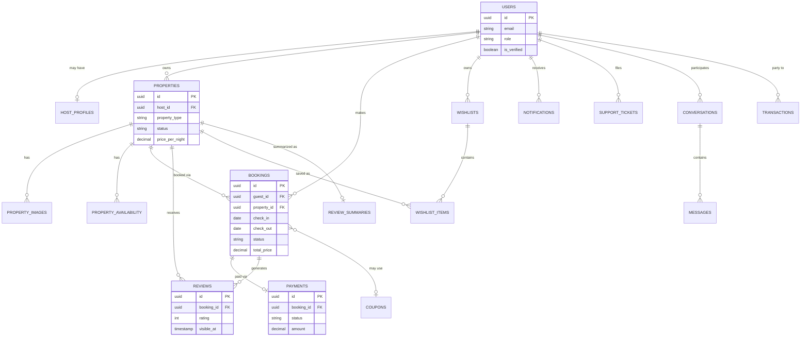

## 25. Architecture

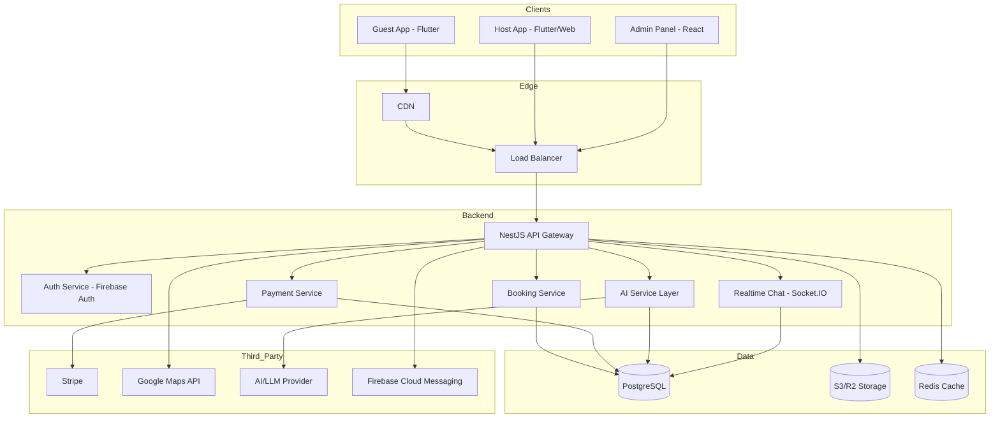

## 26. Authentication

- JWT access token (short-lived, 15 min) + refresh token (30 days, rotated on use), issued by the backend after Firebase Auth verifies the credential (email/password, Google, or Apple).
- Biometric (Face ID/Touch ID) unlocks a previously-stored refresh token on-device; it does not create a new credential type server-side.
- Refresh tokens are revocable (e.g. on logout-all-devices or suspected compromise) via a server-side token blacklist/version check.

## 27. Authorization

- Role (`guest`/`host`/`admin`) is embedded in the JWT and re-verified server-side on every request (never trusted from client alone).
- Resource-level checks (e.g. "is this booking mine?") are enforced in the service layer for every read/write, per the Permission Matrix in Section 17.
- Admin actions additionally check against `audit_logs` requirements — every mutating admin endpoint must write an audit entry as part of the same transaction.

## 28. Caching

- **Redis** caches: search result pages (short TTL, ~60s, invalidated on relevant listing changes), AI Review Summary (`review_summaries` table itself acts as the cache, refreshed by a background job), AI Price Prediction outputs (refreshed daily per property).
- Property Detail pricing/availability is **never** cached beyond request scope — always computed fresh to avoid stale-price bugs.

## 29. Security

- RBAC enforced at the API layer (Section 27).
- `audit_logs` for all Admin state-changing actions, retained indefinitely for dispute resolution.
- 2FA: optional for Hosts, mandatory for Admin accounts.
- Encryption: TLS 1.2+ in transit; at-rest encryption via managed PostgreSQL/S3 encryption (provider default, e.g. AWS KMS).
- PCI-DSS scope minimized: raw card data never touches Stayly servers (Stripe Elements/SDK handles card capture directly).
- GDPR-baseline practices for global/EU guests: data export and deletion request handling via Admin/Support tooling.
- Secrets (Stripe keys, Firebase credentials, LLM API keys) stored in a managed secrets vault, never in source control.

## 30. Performance

- Pagination on all list endpoints (search results, reservations, transactions) — default page size 20, max 50.
- Database indexing per Section 23.
- Image delivery via CDN with responsive sizing (thumbnails for list views, full-res for gallery).
- Lazy loading for below-the-fold content (Home carousels, Property Detail sections).

## 31. Logging

- Application logs: structured JSON, info level for normal request flow, warn/error for failures, retained 30 days in hot storage.
- `audit_logs` (Admin actions) and `ai_interaction_logs` are retained indefinitely as business-critical records, separate from operational logs.

## 32. Monitoring

- Health check endpoints (`/health`) on all services, polled by the load balancer.
- Alerting on: payment success rate drop below 95% (rolling 1h), API p95 latency breach, elevated 5xx rate, Stripe webhook delivery failures.
- Uptime tracking against the 99.9% target (Section 15).

## 33. Analytics

- Events listed per-feature in Section 13 (Analytics Events field) feed a product analytics pipeline (e.g. Amplitude/Mixpanel-class tool — not prescribed, to be selected by the engineering team).
- Admin Analytics screen surfaces: booking trends, revenue trends, cancellation rate, AI feature adoption, host activation rate.
- Data export as CSV for Admin reports.

## 34. Notifications

- Channels: push (FCM) + in-app inbox (all users); email for password reset and booking confirmation (transactional, via a standard email provider — not specified in the source doc, recommend a provider like SES/SendGrid at implementation time).
- Triggers: enumerated in Section 16 (Business Rules).
- Templates: booking confirmed, booking cancelled, new message, review published, price drop on wishlisted property, promotion published — each with a title + body template supporting variable interpolation (guest name, property name, dates).

## 35. Error Handling

- Standard error envelope: `{ "error": { "code": string, "message": string } }` across all API responses.
- User-facing messages are friendly and specific where safe (e.g. "This coupon has expired") and generic where security-sensitive (e.g. login failures never reveal which field was wrong).
- Retry guidance: idempotent GET endpoints retry automatically client-side on network failure; payment/booking mutations require explicit user-initiated retry to avoid double-charging.

## 36. Accessibility

- Target: WCAG 2.1 AA for Guest and Host apps.
- Commitments: minimum 4.5:1 text contrast, all interactive elements reachable via screen reader with descriptive labels, minimum 44×44px tap targets, no information conveyed by color alone (e.g. price prediction badge includes text, not just a color).

## 37. SEO

Applicable to the Guest-facing web surface (property listing pages) for organic discovery: server-rendered or pre-rendered property detail pages, structured data (schema.org `LodgingBusiness`), descriptive URLs (`/property/{slug}-{id}`), sitemap.xml auto-generated from active listings. Not applicable to Host app internals or Admin panel (internal tools).

## 38. Testing Strategy

- **Unit tests**: business logic (pricing calculation, cancellation policy application, coupon validation, review visibility logic) — target ≥ 80% coverage on these modules specifically.
- **Integration tests**: API endpoints against a test database, including the Stripe webhook handler with mocked signatures.
- **E2E tests**: critical paths — registration → search → booking → payment → confirmation; host listing creation → admin approval → guest visibility.
- Test cases per feature are listed in Section 13; these are the minimum required cases, not exhaustive.

## 39. Test Cases

Representative cases are embedded per-feature in Section 13 ("Test Cases" field for each of the 19 features). Additional cross-cutting cases:

- A guest cannot access another guest's booking, wishlist, or conversation via direct ID manipulation (authorization bypass attempt).
- A host cannot approve their own listing (role-based action restriction).
- Concurrent booking attempts for the same property/date range never result in two `confirmed` bookings (Section 13, Booking & Checkout).

## 40. Risk Analysis

| Risk | Category | Mitigation |
|---|---|---|
| Double-booking under concurrent checkout | Technical | Soft-lock on availability during checkout (Section 13, Booking & Checkout) |
| AI Trip Planner/Smart Search hallucinating non-existent listings | Technical/Trust | Tool-call architecture forces recommendations through real inventory search (Section 13, AI features) |
| Commission/fee percentages are placeholder assumptions | Business | Finance sign-off required before production launch (flagged in Section 16) |
| Payment provider outage (Stripe) | Business/Technical | Booking stays `pending`, guest is informed, no partial charge state possible |
| Host supply quality/trust | Business | Mandatory Admin approval + host verification gate (Section 13) |
| Scope size (3 apps + 5 AI features in one v1) | Timeline | Recommend phased internal delivery even though external scope is "full v1" — data model → API → Guest app → Host app → Admin panel → AI layer |

## 41. Deployment

- **Environments**: Development → Staging → Production, each with isolated database and third-party sandbox credentials (Stripe test mode, Firebase test project) in non-prod.
- **Release process**: Staging deploy + smoke test → manual QA sign-off on critical paths (Section 38) → production deploy.
- **Rollback plan**: Blue-green or rolling deployment on the API layer to allow immediate rollback; database migrations must be backward-compatible for one release cycle to support rollback safety.

## 42. CI/CD

- Pipeline stages: lint → unit tests → build → integration tests → deploy to staging → E2E smoke tests → manual approval gate → deploy to production.
- Automated checks block merge on: failing tests, lint errors, and (recommended) a minimum coverage threshold on business-logic modules (Section 38).

## 43. Future Roadmap

Deferred from v1, in suggested order:
1. Indonesia expansion: Midtrans integration, IDR currency, Bahasa Indonesia localization.
2. Premium Host subscription tier.
3. In-app advertising (sponsored listings).
4. Travel Insurance upsell at checkout.
5. Airport Pickup add-on booking.
6. "Experience" bookings (local activities/culture, as explored in the LocalHost concept).
7. 360° property tours.
8. Multi-tier Admin roles (Super Admin / Support Agent split).
9. Multi-currency display beyond USD/IDR.

## 44. Appendix

### Glossary
- **GBV**: Gross Booking Value — total value of confirmed bookings before fee deductions.
- **MAU**: Monthly Active Users.
- **PII**: Personally Identifiable Information.
- **SCA**: Strong Customer Authentication (EU payment regulation, handled via Stripe's 3-D Secure flow).

### Assumption Log (full)

| Assumption | Confidence | Area |
|---|---|---|
| Backend framework: NestJS over Express | Medium | Tech Stack |
| Auth provider: Firebase Auth over Clerk | Medium | Tech Stack |
| Realtime chat: Socket.IO over Firebase Realtime | Medium | Tech Stack |
| Guest service fee 3%, host commission 12% | Low | Business Rules |
| Cancellation policy: 3-tier (Flexible/Moderate/Strict) | Medium | Business Rules |
| Host payout: 24h post check-in, weekly batch | Low | Business Rules |
| Review visibility: double-blind, 14-day fallback | Medium | Business Rules |
| Single-tier Admin role (no Super Admin/Support Agent split) | Medium | Roles |
| AI/LLM provider unspecified (generic LLM API assumed) | Low | Integrations |
| 2FA optional for Host, mandatory for Admin | Medium | Security |
| GDPR-baseline compliance for EU guests | Medium | Security |
| WCAG 2.1 AA target | Medium | NFR (default) |
| Offline mode not required for v1 | Medium | NFR |
| ~50,000 MAU Year 1 sizing target | Low | NFR |
| English primary language, Bahasa Indonesia deferred | High | NFR (confirmed by user) |

### References
- Source concept document: `DESIGN-airbnb.md` (uploaded by user, Stayly concept + design system + tech stack).

---

## Mermaid Diagrams (supplementary — full set)

### User Flow — Book a Stay (Guest)

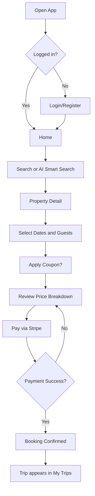

### Sequence Diagram — Booking & Payment

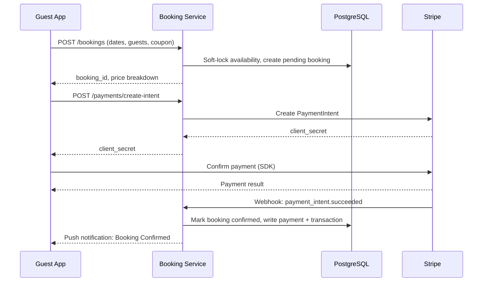

### Sequence Diagram — AI Smart Search

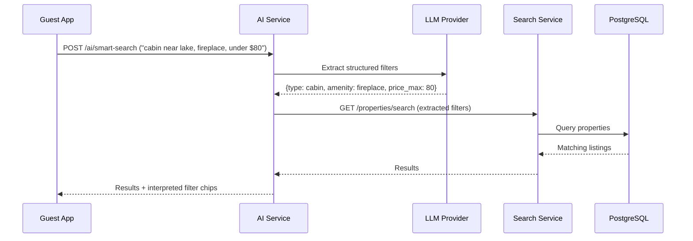

### State Diagram — Booking Lifecycle

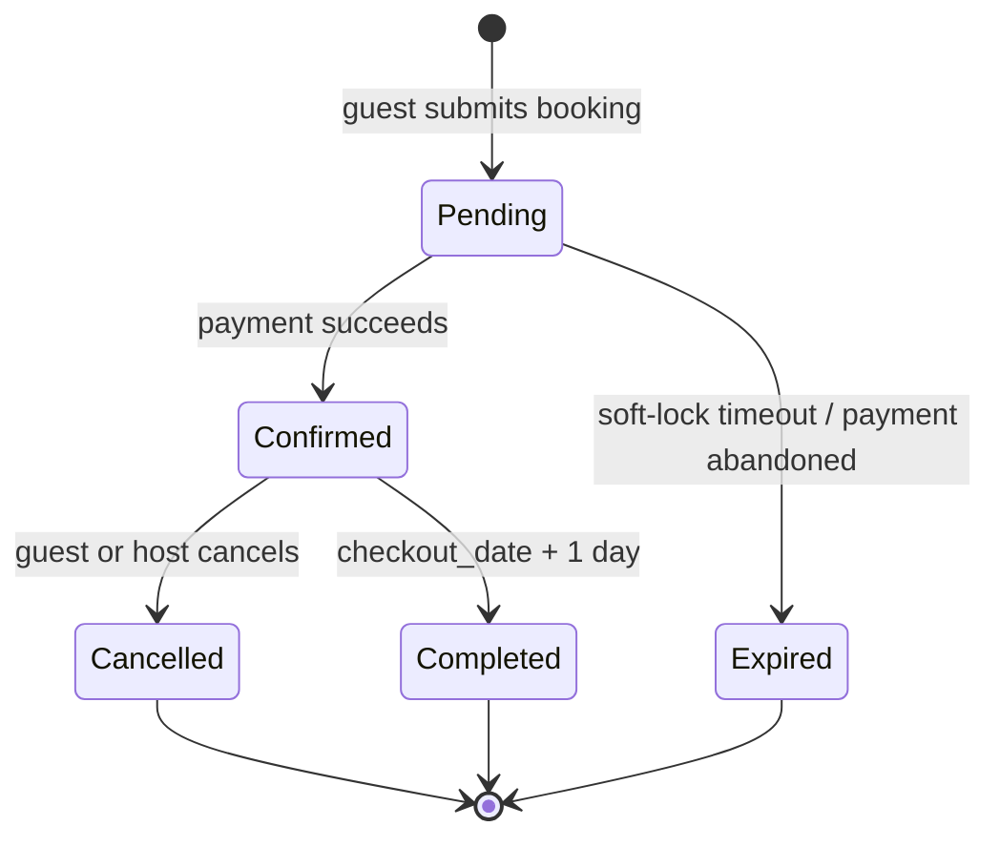

### State Diagram — Property Listing Lifecycle

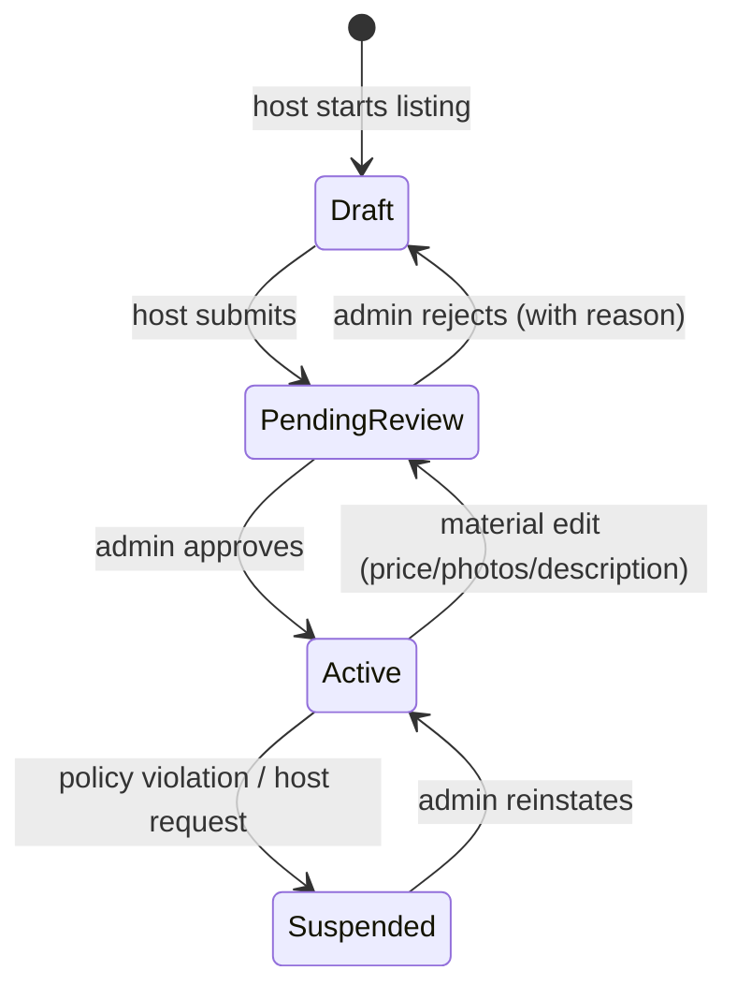

### Activity Diagram — Property Approval Workflow

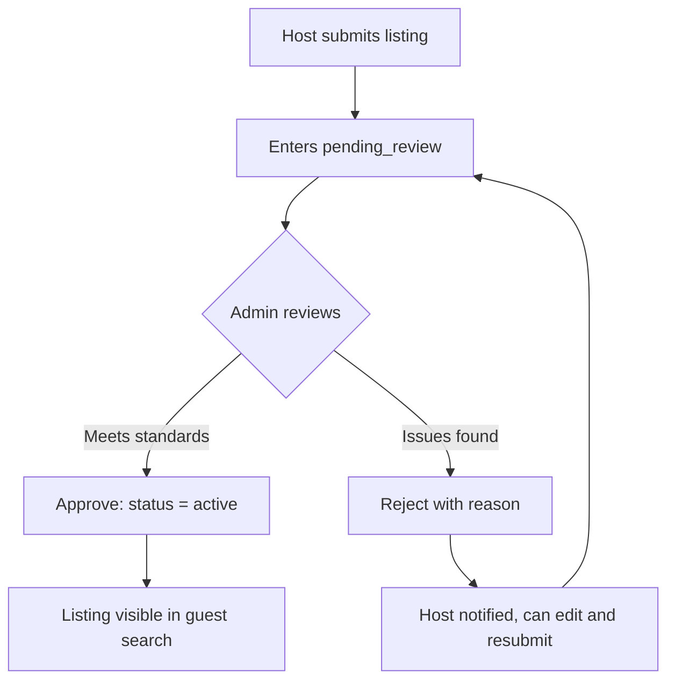

### Class Diagram — Core Domain Model

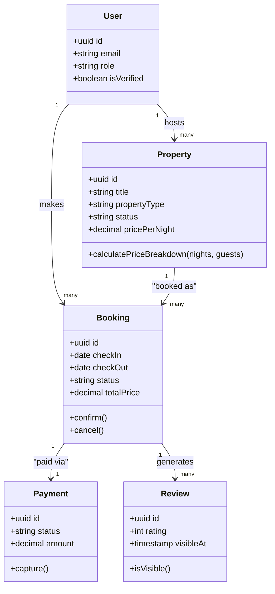

### Data Flow Diagram — Search & AI Layer

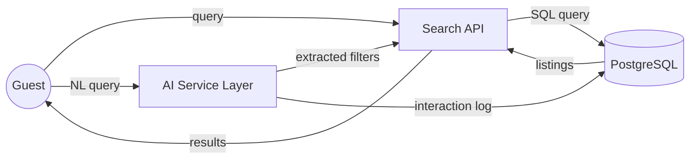

### Component Diagram

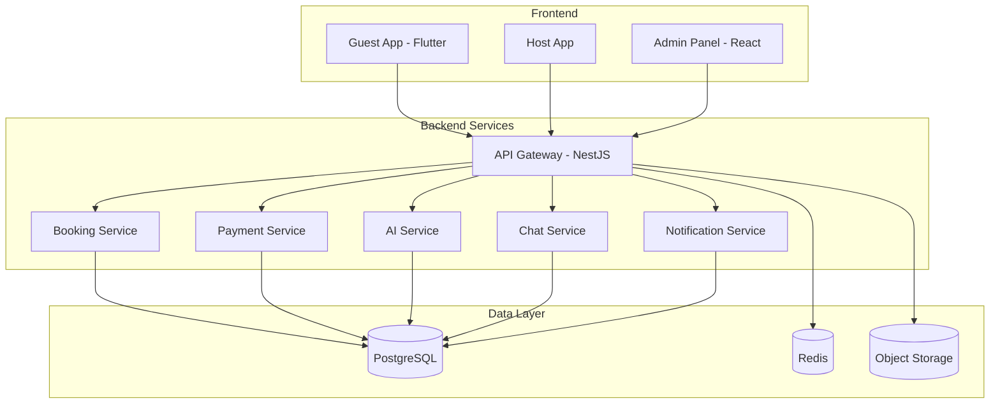

### Journey Map — Guest Experience

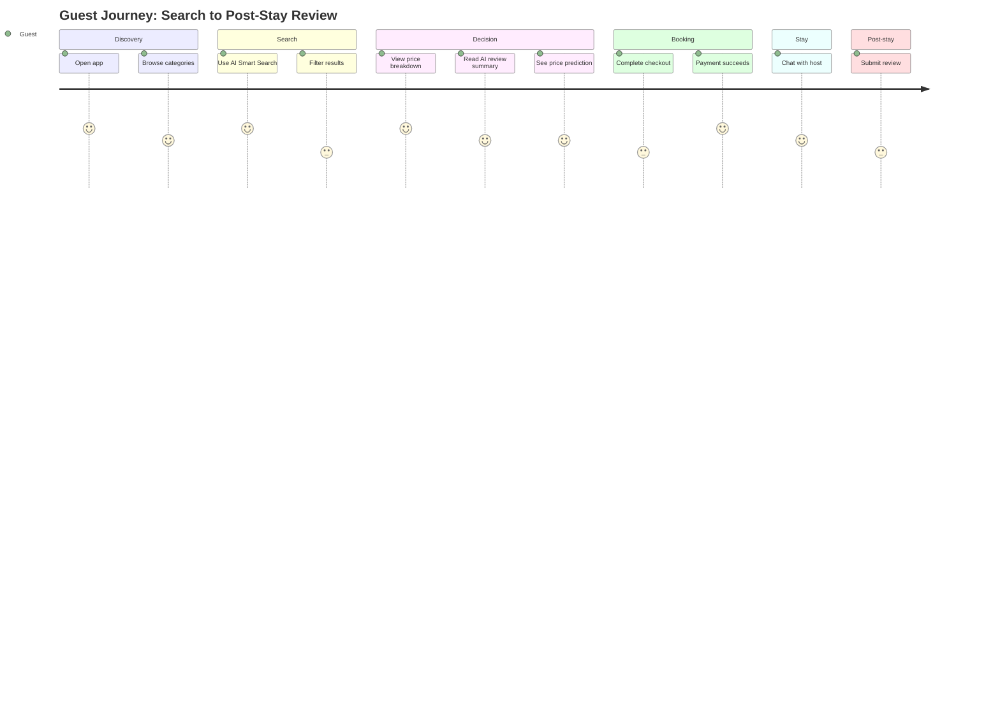

### Deployment Diagram

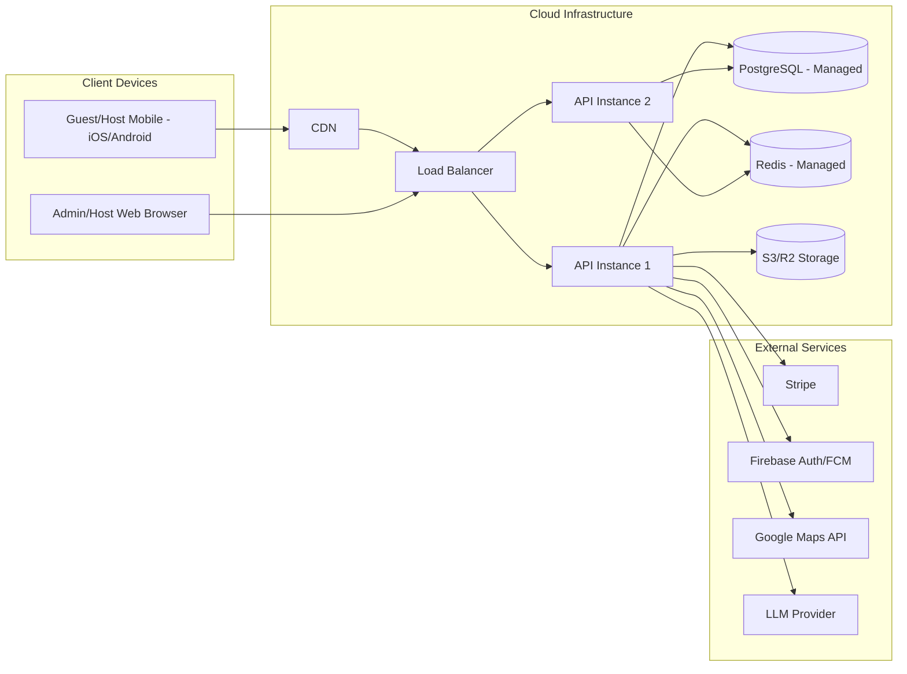

---

## AI Coding Handoff

Ready-to-paste prompts for building Stayly with an AI coding agent. Each prompt treats this PRD (`PRD_Stayly_v1.md`) as the single source of truth. Tech stack: Flutter (Guest/Host apps), React (Admin panel), NestJS (backend), PostgreSQL, Stripe, Firebase Auth/FCM, Socket.IO, Google Maps API.

### Claude Code
```
You are implementing Stayly based on PRD_Stayly_v1.md, which is the single source of truth for this project.

Read the full PRD before writing any code. Build in this order: data model (Section 23) → API layer (Section 22) → core business logic (pricing, booking, payment per Section 13) → UI (Guest app, then Host app, then Admin panel). For every feature, implement exactly the Functional Requirements, Business Rules, and Edge Cases listed under that feature's entry in "Feature Breakdown" (Section 13) — do not add scope beyond what's written there.

Tech stack: NestJS (backend), PostgreSQL, Flutter (Guest/Host mobile apps), React (Admin panel), Stripe (payments), Firebase Auth + FCM, Socket.IO (chat). Follow Section 23 (Database Design), Section 22 (API Requirements), and Section 25 (Architecture) exactly as specified.

If something in the PRD is ambiguous or missing, stop and ask rather than guessing — especially the Low-confidence assumptions flagged in the Appendix (Section 44), like commission percentages and the AI/LLM provider choice. Write tests matching the "Test Cases" listed per feature (Section 13) and Section 39.
```

### Cursor
```
Use PRD_Stayly_v1.md in this repo as the authoritative spec for Stayly. Before generating code for any feature, locate its entry in "Feature Breakdown" (Section 13) and implement Purpose, Business Logic, Acceptance Criteria, Edge Cases, and Validation Rules exactly as written. Match Section 23 (Database Design) and Section 22 (API Requirements) for schema and endpoint shape. Stack is NestJS + PostgreSQL + Flutter + React + Stripe + Firebase Auth/FCM + Socket.IO — don't introduce other libraries or architectural patterns without flagging it first.
```

### GitHub Copilot
```
Reference PRD_Stayly_v1.md for all implementation decisions on Stayly. When suggesting code for a feature, check the corresponding "Feature Breakdown" entry (Section 13) for its Acceptance Criteria and Edge Cases before completing the suggestion. Follow the Permission Matrix (Section 17) strictly for any authorization logic, and never trust client-submitted totals for pricing (Section 14, FR-20).
```

### Windsurf
```
This project is scoped entirely by PRD_Stayly_v1.md. Treat every functional requirement, business rule, and validation rule listed there as binding. Build screens per the Screen Inventory (Section 21) and Sitemap (Section 20), and wire them to the API Requirements (Section 22). Flag anything in the PRD that seems internally inconsistent instead of silently resolving it — in particular the Low-confidence assumptions in Section 44 should be confirmed with the user before being treated as final.
```

### Lovable
```
Build Stayly using PRD_Stayly_v1.md as the spec. Match the Wireframe Planning (Section 18), Navigation (Section 19), and Screen Inventory (Section 21) sections for UI structure, and the color tokens/design style in Section 18 for visual style (#FF5A5F primary, #FFFFFF secondary, #0F172A accent, #22C55E success, #F59E0B warning; Apple-inspired, minimal, rounded cards, soft shadows). Implement each screen's empty/loading/error states as described per feature in Section 13.
```

### Bolt
```
Scaffold Stayly from PRD_Stayly_v1.md. Start with Section 23 (Database Design) and Section 22 (API Requirements) to set up the backend (NestJS + PostgreSQL), then build screens per Section 20 (Sitemap) and Section 21 (Screen Inventory). Implement the Permission Matrix (Section 17) as route/component guards. Use Section 15 (Non-Functional Requirements) to guide performance and accessibility decisions.
```
